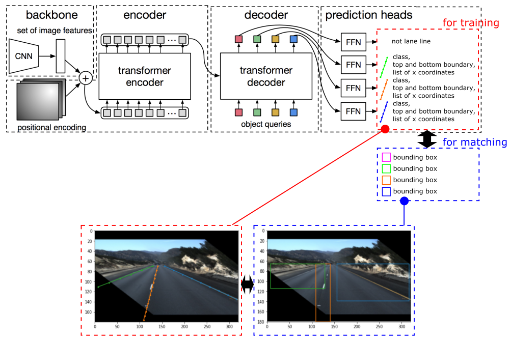

# LaneDetection_DETR

This is an implementation of lane detection using DETR. Thanks to DETR, End-to-End aproach towards lane detection is achieved.
This implementation is based on below contributions.
- [original DETR](https://github.com/facebookresearch/detr)
- [transfer learning example of DETR](https://www.kaggle.com/tanulsingh077/end-to-end-object-detection-with-transformers-detr)

Here are some examples of inferences.


# Requirement

## training data
* download dataset of [TuSimple lane_detection](https://github.com/TuSimple/tusimple-benchmark/tree/master/doc/lane_detection)
* store dataset as follow

```
.
└── /trainset
    ├── label_data_0313.json
    ├── label_data_0531.json
    ├── label_data_0601.json
    └─ /clips
         ├─ /0313-1
         │    ├─ /60
         │    ....
         ....
```

## environment
This implementation is checked below environment.
* python 3.6.11
* pytorch 1.5.0
* torchvision 0.6.0

# Architecture
This is an overview of the network.



Backbone and encoder/decoder is same as original DETR.

Prediction heads are replaced to adopt to lane detection. LaneDetection_DETR outputs lane candidates as belows.
- **class label** : Same as the original (number of classes + 1) dimension output. This time, it is a two-dimensional output because it was judged only whether it was a lane marking or a background.
- **Top and bottom of the lane marking** : The y coordinate that shows the target lane marking in the image. Two-dimensional output at the top and bottom.
- **X-coordinate sequence of lane markings** : The lane markings are regarded as "point sequences separated at equal intervals", and an array containing the x-coordinates of each point is output. An invalid value is set for the height without a lane marking.

Lane candidates are converted to general bounding box in order to judge bipartite matchings between candidates and ground truth.

Brief explanation is written [here](https://translate.googleusercontent.com/translate_c?depth=1&hl=en&nv=1&pto=aue&rurl=translate.google.com&sl=ja&sp=nmt4&tl=en&u=https://qiita.com/tkskbys/items/8e91eb8498784286cdbc&usg=ALkJrhj7zua7YBlMJJjgKKJZ_9PQ98_88Q).

